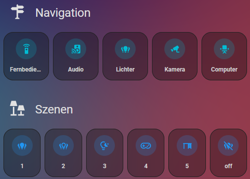

# HA-icon-title
A Custom Lovelace Card for Home Assistant wich displays an icon next to a title.




## Usage
```yaml	
type: 'custom:icon-title'
title: Title
icon: mdi:icon
```

## Installation
### HACS
1. Open HACS UI
2. Go to _Frontend_ tab
3. Click the three dots in the top right corner and select _Custom Repositories_
4. Add the URL of this repository and select _Lovelace_ as category
  - URL: https://github.com/marttasch/HA-icon-title
  - Category: Lovelace
5. Click _Add_
6. Click the plus icon in the bottom right corner and search for _icon-title_ and install it

### Manual
1. Download `icon-title.js` from the latest release.
2. Place the file in your `config/www` folder.
3. Add a reference to `icon-title.js` in Dashboard. There are two ways to do this:
    - **Using UI:** _Settings_ → _Dashboards_ → _More Options icon_ → _Resources_ → _Add Resource_ → Set _Url_ as `/local/icon-title.js` → Set _Resource type_ as `JavaScript Module`.
      **Note:** If you do not see the Resources menu, you will need to enable _Advanced Mode_ in your _User Profile_
    - **Using YAML:** Add following code to `lovelace` section.
        ```yaml
        resources:
            - url: /local/icon-title.js
              type: module
        ```